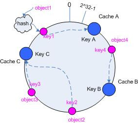

# 一致性Hash
一致性Hash是通过就近Hash值尽量避免目标节点的变化为Hash命中带来的较大波动。我们的常规hash方法，若hash table的length发生变化是需要rehash的，而rehash必然会重建数据，若数据量很小，这样的影响并不大，但是若数据量很大时rehash将会耗许多时间，这若在分布式缓存场景中是无法接受的，因此在分布式缓存场景 **一致性Hash** 诞生了。




```
 int N = 100
 int ring[] = N
 def add_node:
   ring[N+1] = node
   N++
   sort(ring, (a,b)->hash(a)-hash(b))
 
 def del_node:
   del ring[node]
   N--
   sort(ring, (a,b)->hash(a)-hash(b))
 
 def get:
   while hash(node) > hash(K);
     node = node.next
   return node.get(K)
    
```


